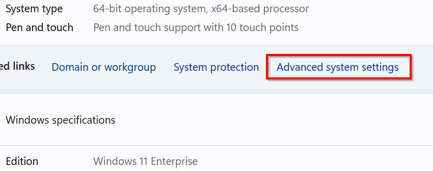
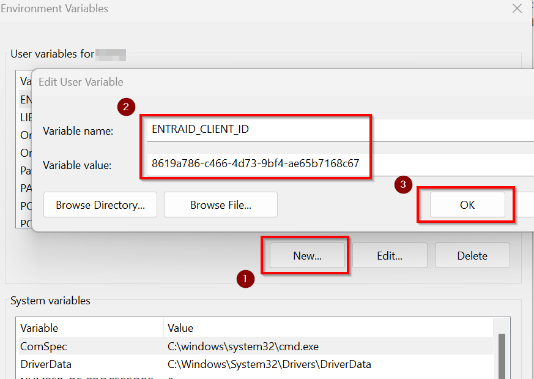

# Set a default Client ID

As of September 9th, 2024, it is no longer possible to use PnP PowerShell with `-Interactive` without [providing your own Entra ID App Registration](registerapplication.md) by passing in `-ClientId` as well. To avoid having to add `-ClientId` on every connect, you can also perform the below task to set the default ClientId for your environment. This avoids you having to update all of your scripts to include `-ClientId` in the Connect-PnPOnline statements, making the impact of this change smaller by not having to update existing scripts.

## By setting an environment variable

You can set an environment variable on your machine or in your profile to default to the ClientId you configure in it. The name of the environment variable should be either: `ENTRAID_APP_ID`, or `ENTRAID_CLIENT_ID`, or `AZURE_CLIENT_ID`. You only need one of these, not all of them. They will be used in the order shown, i.e. if you set a value for `AZURE_CLIENT_ID` and another one for `ENTRAID_APP_ID`, the `ENTRAID_APP_ID` entry will be used and the other will be ignored.  

As the value for the environment variable, set the GUID of the Client Id / App Id from Entra ID of [your own App Registration](registerapplication.md).

### Steps for Windows

To create an environment variable on a Windows machine, follow the below steps.

1. Right click on the Windows start icon on your Windows taskbar and click on _System_
   
   

1. Click on _Advanced system settings_
   
   

1. Click on _Environment Variables_
   
   

1. Under _User variables for \<username\>_, click the _New_ button. As the _Variable name_, enter:

   ENTRAID_CLIENT_ID

   As the _Variable value_ enter the Client ID of your Entra ID application registration which you would like to use as the default for all Connect-PnPOnline executions.

   Close all open dialog boxes by clicking on _OK_
   
   
   
## Troubleshooting

In case you want to validate which ClientID is being used to connect, simply add `-Verbose` to your `Connect-PnPOnline` statement to see which ClientID is used to make the connection.

