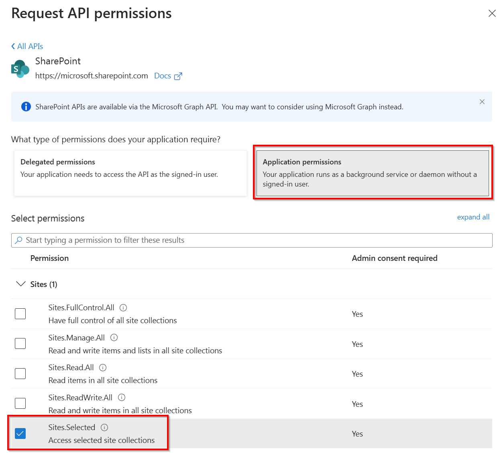
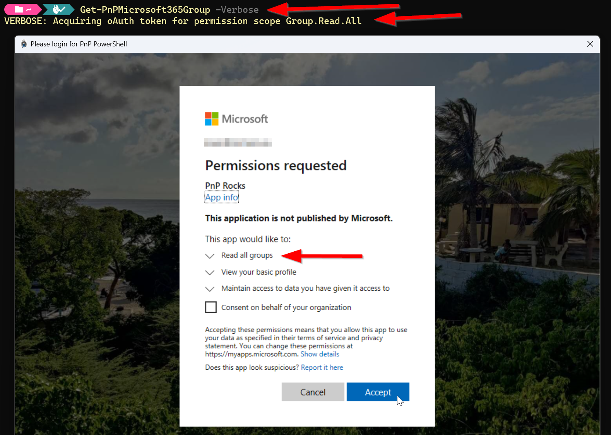
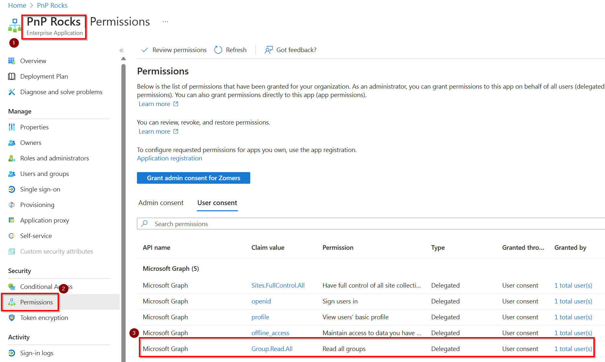

# How to determine which permissions you need

> [!IMPORTANT]
> As of September 9<sup>th</sup>, 2024, it is [required to use your own Entra ID Application Registration](https://github.com/pnp/powershell/issues/4250) to use PnP PowerShell. This introduces the complexity of trying to determine the minimum set of permissions you will need to be able to execute your script. This article aims to help you in determining the permissions you need to set on your Entra ID Application Registration.

## Creating an Entra ID Application Registration

In case you're starting from the beginning and you do not have your own Entra ID Application Registration yet to use with PnP Powershell, which is mandatory, you can [follow these steps](registerapplication.md) to create your Entra ID Application Registration.

## Starting with minimal permissions

It is highly recommended to keep the permissions on your Entra ID Application Registration to a minimum to avoid risks when access through your application registration would somehow fall in the wrong hands. As PnP PowerShell always starts with connecting to SharePoint Online, you will at least need permissions to access SharePoint Online, regardless of whatever else you plan on doing with PnP PowerShell.

### When using a delegate login

A delegate login means you will be interactively logging in to your tenant using PnP PowerShell by providing your credentials. There are [several ways](authentication.md) of connecting in this way. Always remember that in this scenario, regardless of which permissions you assign to your Entra ID Application Registration, the user logging in through PnP PowerShell _must_ also have the permissions for whatever the user is trying to do. I.e. if you would assign `AllSites.FullControl` permissions on your application registration, the user still can only access those SharePoint Online sites to which the user has been granted permissions directly to that site as well and will only have those permissions assigned to it (i.e. read or write).

The lowest permission you can set on a delegate login will be `AllSites.Read` on the delegate scope of SharePoint:


### When using an app only context

An app only context is being used when your intend is to run a script that does not require any user intervention to connect and authenticate to your tenant. There are [several ways](authentication.md) of connecting in this way. In this scenario, exactly those permissions you assign to your Entra ID Application Registration are the ones the script that runs will have. Therefore, be extra careful in this scenario not to set too high permissions.

The lowest permission you can set on an app only scenario will be `Sites.Selected` on the application scope of SharePoint:



When using the `Sites.Selected` permission, you still must assign permissions to one or more sites where the script will have access to. Ensure you will assign at least `Read` permissions on the site of which you will use the URL in your `Connect-PnPOnline <url>` statement in your script. You can easily do so by utilizing the PnP PowerShell cmdlet [Grant-PnPAzureADAppSitePermission](../cmdlets/Grant-PnPAzureADAppSitePermission.md) as shown here:

```powershell
Grant-PnPAzureADAppSitePermission -AppId "<Client ID of your Entra ID applicarion registration>" -DisplayName "PnP PowerShell" -Permissions Read -Site <url of the SharePoint Online site to which you will connect>
```

In order to be able to run this cmdlet, you will need to connect to PnP PowerShell using preferably another Entra ID application registration which will have the `AllSites.FullControl` permission on the delegate scope on SharePoint set to it and being logged on with a Global Administrator or SharePoint Administrator priviledged account.

## Adding additional permissions as needed

Once you've se the minimum permissions as described above, you can go ahead and test using your Entra ID application registration to connect to SharePoint Online using [one of the available connect options](authentication.md). You can add `-ValidateConnection -Verbose` to your `Connect-PnPOnline` cmdlet to instruct it to test the connection once established.

Now you likely want to perform more than just a simple read using PnP PowerShell. Read on below to find out what you can do to find out about the additional permissions your application registration might need to operate correctly.

### When using a delegate login

When planning to use your app registration for delegates, you could opt for simply starting to use it. Once you execute a cmdlet that requires more permissions, a dialog will pop up asking you to consent to these additional permissions being assigned to the application registration. An example of this is shown on the following screenshot:



What technically happens here when you provide consent through this dialog is that in the Entra ID Enterprise Application connected to your Entra ID application registration, the permission gets added. This means that on subsequent requests of this cmdlet using this client id, even in new sessions, these permissions will then be granted already. You can visualize this by going to [Entra ID](https://entra.microsoft.com) > Identity > Applications > Enterprise applications and looking for the registration with the same name as your Entra ID application registration. Once found, open it, in the menu click on _Permissions_, go to the _User consent_ tab and look at the assigned permissions:



### When using an app only context

For an app only scenario, you will have to follow a different approach, as there is no way for it to interactively request for more permissions. If you try to execute a cmdlet for which the Entra ID application registration does not have permissions, it will return you an access denied notice.

What you could try if you run into this, is to add `-Verbose` to your cmdlet. For many, but unfortunately not all, cmdlets, this will reveal which permissions it receives through the application registration and which permissions it actually needs to be able to execute properly. See the following example:


In this scenario, you now know you need to add `Group.Read.All` on the applications scope of Microsoft Graph in your application registration in order to give it sufficient rights to execute this cmdlet.

## Help, I can't figure out which permissions I need

As mentioned above, unfortunately, not for all cmdlets it will be clear which exact (minimum) permissions will be needed. Not even when using `-Verbose`. To give some guidance which permissions you could try for a minimum permissions approach, follow the table below.

What are you trying to do | Permission type | Permission(s) likely needed from least to most priviledged 
| ------------------------| --------------- | -------------------------- |
| Interact with SharePoint | Delegate | AllSites.Read / AllSites.Write / AllSites.Manage / AllSites.FullControl |
| Interact with SharePoint | App Only | Sites.Selected / Sites.Read.All / Sites.ReadWrite.All / Sites.Manage.All / Sites.FullControl .All |
| Interact with Microsoft Graph | Delegate \ App Only | Use `-Verbose` or look at [the documentation](../cmdlets/index.md) to find the permissions needed |
| Interact with Power Platform | Delegate | `Azure Service Management\user_impersonation` AND `Dynamics CRM\user_impersonation` AND `PowerApps Service\User` (the last one you can find on the second tab: APIs that my organization uses) |
