# Using PnP PowerShell with Microsoft Search

> [!NOTE]
> On August 18<sup>th</sup>, 2024, Microsoft has announced through Message Center Announcement MC865187 that it will no longer charge extra for adding items to the Microsoft Search index. 50 million items can be added to the Microsoft Search index for free on any tenant having at least one of these licenses: Office 365 E1, Office 365 E3, Office 365 E5, Microsoft 365 E3, Microsoft 365 E5, Microsoft 365 F1, Microsoft 365 F3, Office 365 F3, Microsoft 365 Business Basic, Microsoft 365 Business Standard, Microsoft 365 Business Premium, Office 365 G1, Office 365 G3, Office 365 G5, Microsoft 365 G3, Microsoft 365 G5, Office 365 A3, Office 365 A5, Microsoft 365 A3, Microsoft 365 A5.

Adding your own content to the Microsoft Search index can be a very interesting option for a lot of organizations. Ingesting content coming from other applications used within the organization allows for one search engine, Microsoft Search, to return results even beyond the Microsoft landscape scope. Users will no longer have to consult several search engines or will have to think where they would be able to find the content they look for. Instead, the search results will point them to where they can find it, regardless of the source it can be found in.

> [!TIP]
> Optionally combine this with Microsoft Copilot for Microsoft 365 and leverage the full strength of AI that "knows" about your organizational data and is able to answer questions from employees in natural language, saving a lot of valuable time for not having to search for exact phrases that exist in indexed content.

## Which content can I add to the Microsoft Search Index

First, think of which data in your organization could be useful to add to the Microsoft Search index. Examples could be your corporate intranet, if it doesn't run on SharePoint Online, documentation sites, archives, databases, fileshares, non-Microsoft cloud storage platforms, helpdesk ticketing systems or more. It does not even have to be content that can directly be linked to, but rather could be informational to people looking for it. As long as you have a way to access the data in the system you want to index, PnP PowerShell can assist you in easily adding this content to the Microsoft Search index.

## Where do I start

After defining one or more content sources you would like to add to the Microsoft Search Index, first check if there is an existing connector for that content source already. After all, there's no need to reinvent the wheel. Microsoft has created and is offering connectors to various popular platforms for free. You can [find them here](https://learn.microsoft.com/en-us/microsoftsearch/connectors-overview#microsoft-graph-connectors-by-microsoft). Next to that, Microsoft partners have also created over 100 connectors that can be used. Sometimes against a fee. Check [this page to see which ones are available](https://learn.microsoft.com/en-us/microsoftsearch/connectors-gallery).

If the content source you want to index does not have a connector yet, or for some reason the connector offered doesn't exactly do what you want it to do, you can also easily add the content to the Microsoft Search Index yourself, using PnP PowerShell.

## How can I leverage PnP PowerShell to get my content into the Microsoft Search Index

PnP PowerShell can play a great role in adding your organization's content to the Microsoft Search index. Setting this up can be accomplished well under 30 minutes. Just follow the steps below to make it happen.

> [!WARNING]
> You need to have the Search Administrator or Global Administrator role to perform the following tasks.

### Step 1: Creating a new custom connector

In this step we're going to create a new custom connector. A custom connector is going to represent the data source we're going to ingest items from into the Microsoft Search Index. Although the web interface of the Microsoft 365 Admin Center has an option to create a new Custom connector, it cannot be used for this purpose. Instead, we'll use PnP PowerShell to create our custom connector.

1. Open a new PowerShell 7 session and [connect to your tenant using an account](authentication.md#interactive-authentication) that has the Search Administrator or Global Administrator role

```powershell
Connect-PnPOnline [yourtenant].sharepoint.com -Interactive -ClientId <client id of your Entra ID Application Registration>
```

   

2. Use the [New-PnPSearchExternalConnection](/cmdlets/New-PnPSearchExternalConnection.md) cmdlet to create the new custom connector to your data. Be sure to replace the identity, name and description values with something meaningful that indicates the source of the data you're going to add to the index.

```powershell
New-PnPSearchExternalConnection -Identity "mycustomdatasource" -Name "My custom data source" -Description "External content ingested using PnP PowerShell"
```

   

3. You can optionally validate that the custom connector has been created by going to the [Microsoft 365 Admin Center](https://admin.microsoft.com) > Settings > Search & intelligence > Data sources ([direct link](https://admin.microsoft.com/#/MicrosoftSearch/connectors)) where it should now show up.

   

## Step 2: Creating a search schema

The second step consists out of creating a search schema for your custom connector. The search schema simply tells Microsoft Search what kind of data it can expect and through which of this data it can search to look for matches to what end users will be searching for. I.e. will it have a title, description, person last modifying the content, priority, or other fields. This is totally up to you to define based on what makes sense with regards to the data source you're going to be indexing from.

1. In the PowerShell session we still have open from the first step, we're going to use the [Set-PnPSearchExternalSchema](/cmdlets/Set-PnPSearchExternalSchema.md) cmdlet to create the schema. If you later on want to update it, you can use the same cmdlet with the same parameters, hence the Set verb and not the New verb being used. The schema in the below sample is defined as JSON in text, so you can easily modify it to match your scenario. Ensure that the name for ConnectionId matches with the value you have used for Identity when creating the connection.

  ```powershell
Set-PnPSearchExternalSchema -ConnectionId "mycustomdatasource" -SchemaAsText '{
   "baseType": "microsoft.graph.externalItem",
   "properties": [
     {
       "name": "title",
       "type": "String",
       "isSearchable": "true",
       "isRetrievable": "true",
       "labels": [
         "title"
       ]
     },
     {
       "name": "url",
       "type": "String",
       "isSearchable": "false",
       "isRetrievable": "true",
       "labels": [
         "url"
       ]
     },
     {
       "name": "iconUrl",
       "type": "String",
       "isSearchable": "false",
       "isRetrievable": "true",
       "labels": [
         "iconUrl"
       ]
     },
     {
       "name": "description",
       "type": "String",
       "isSearchable": "true",
       "isRetrievable": "true"
     }
   ]
 }' -Wait
  ```

  In this JSON schema you will notice `isSearchable` and `isRetrievable`. The first means that Microsoft Search is allowed to use the content provided in that field to look for a match with what the user is searching for. The latter means the value of this field will be returned in the search results and can be used to display it to the user in the search results.

  The script will wait and validate if the schema change has been applied and return to the prompt when it's ready to be used. If you don't want to wait and just let it create or update the schema in the background, remove the `-Wait` parameter. If you receive a response stating "The specified resource name already exists", it means that the connector is currently still busy updating its schema from a previous instruction. Wait a couple of minutes and try it again.

2. You can optionally validate that the custom connector has recieved a schema by going to the [Microsoft 365 Admin Center](https://admin.microsoft.com) > Settings > Search & intelligence > Data sources ([direct link](https://admin.microsoft.com/#/MicrosoftSearch/connectors)) where it should show a Connection state of Ready to indicate that it's ready to receive ingested items. It may take 10 minutes or more for it to reach the Ready state. If it's showing the Connection state _Preparing to sync_, it means it is still applying the schema.

   

### Step 3: Configure where your search results should be shown

Ingesting items into the Microsoft Search index will only prove to be useful if they show up somewhere in search results. In this step we're going to take care of that. For this you have two options: have the results show up under the All vertical along with all the other items it matches with or give the results its own so called vertical. The latter means it will have its own tab in Microsoft 365 Search and only when clicked on that tab, it will show results from this source and this source only, so not mixed up with other results from other sources it may find.

1. If you decide to go with the results showing up in the All tab, so along with results from other sources, simply go to the [Microsoft 365 Admin Center](https://admin.microsoft.com) > Settings > Search & intelligence > Data sources ([direct link](https://admin.microsoft.com/#/MicrosoftSearch/connectors)) and click on the link next to your custom connector that reads _Include Connector Results_.

   

  > [!IMPORTANT]
  > If you want your ingested search items to be shown in Microsoft 365 Copilot results, at present you _must_ add your content to the All vertical, or else Copilot will be unable to find your content.

   In the popup that appears after doing so, click _OK_ to confirm having items from this index show up in the All tab.

   

2. If you decide to (also?) give it its own tab in the Microsoft 365 Search instead, navigate to the [Microsoft 365 Admin Center](https://admin.microsoft.com) > Settings > Search & intelligence > Customizations > Verticals ([direct link](https://admin.microsoft.com/#/MicrosoftSearch/verticals)).
  
3. Click on _+ Add_

   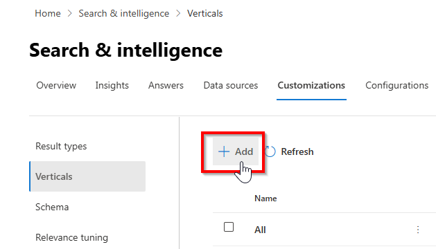

4. Enter the _Name_ you would like to show up as the tab in Microsoft 365 Search for this source and click _Next_

   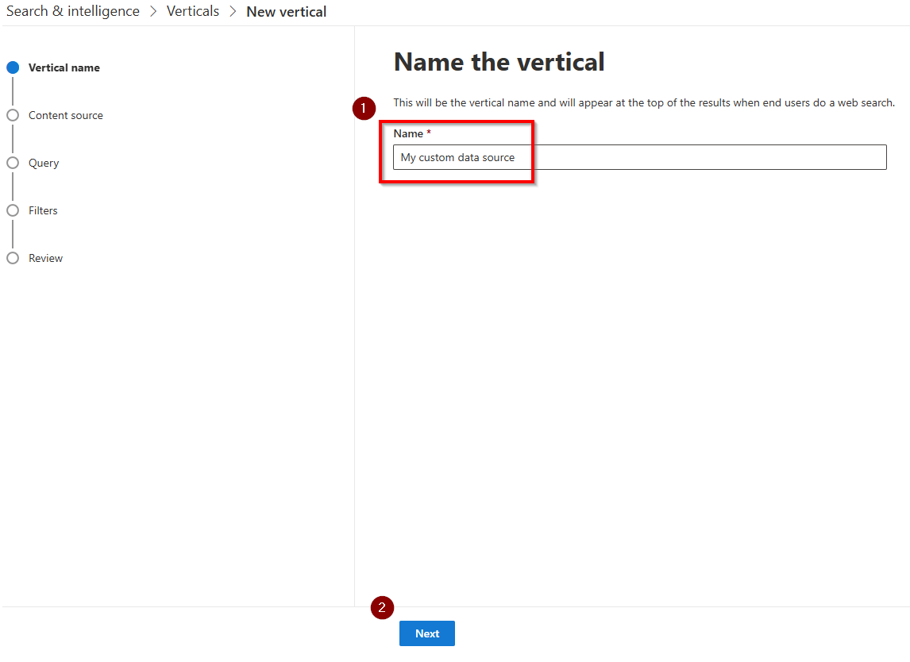
   
5. Click on _Connectors_ to expand the list with available connectors

   
  
6. Check the box in front of the connector you have created in step 1 above. Click _Next_ to continue.

   

7. The _Add a query_ step you can skip by clicking on _Next_ at the bottom.

   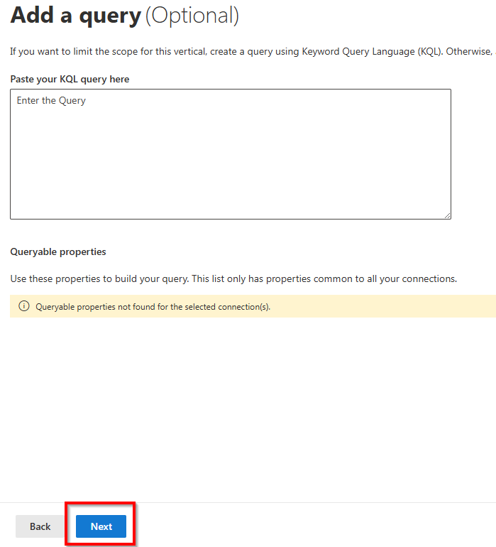

8. The _Filters_ step you can also skip by clicking on _Next_ at the bottom.

   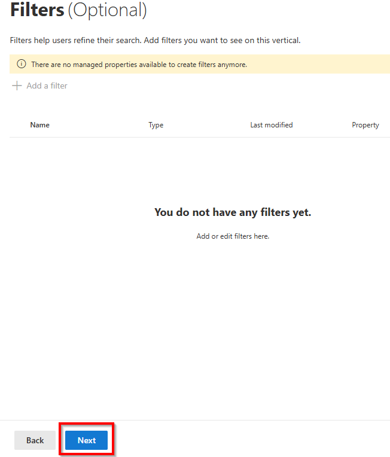

9. Click on _Add Vertical_ at the bottom of the _Review the vertical settings_ step to continue once again.

   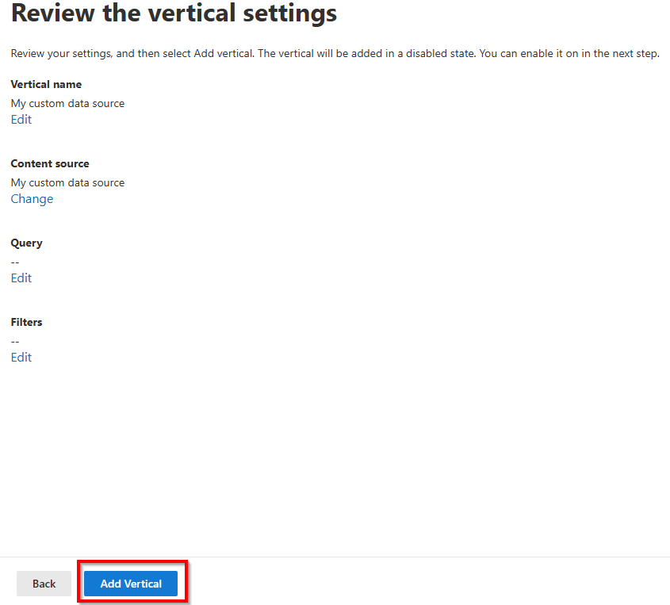

10. Click on _Enable vertical_ to enable it. Once it's done spinning, click on _Done_ at the bottom to finalize adding the vertical.

    

It may take up to an hour before the vertical/tab starts showing up in the Microsoft 365 Search results. To validate if the vertical has been added, go to https://www.microsoft365.com/search and check if it shows a tab with the name you have used to create the vertical in this step at the top of the search results.


### Step 4: Configure how the search results should be shown

You can define how the items coming from your custom source will be shown in the Microsoft 365 Search results. In this step we will take care of this. In some scenarios you could skip this entire step and let it try to render the results using a default visualization. In some scenarios however you will notice that it will show an error when it tries to render the results coming from your indexed items. To play on the safe side, it is recommended to always provide your custom display template that it can use to render the results.

1. Navigate to the [Microsoft 365 Admin Center](https://admin.microsoft.com) > Settings > Search & intelligence > Customizations > Result types ([direct link](https://admin.microsoft.com/#/MicrosoftSearch/resulttypes)).

2. Click on _+ Add_ to add a new result type

   

3. Provide any _Name_ you would like for the result type and click _Next_ at the bottom.

   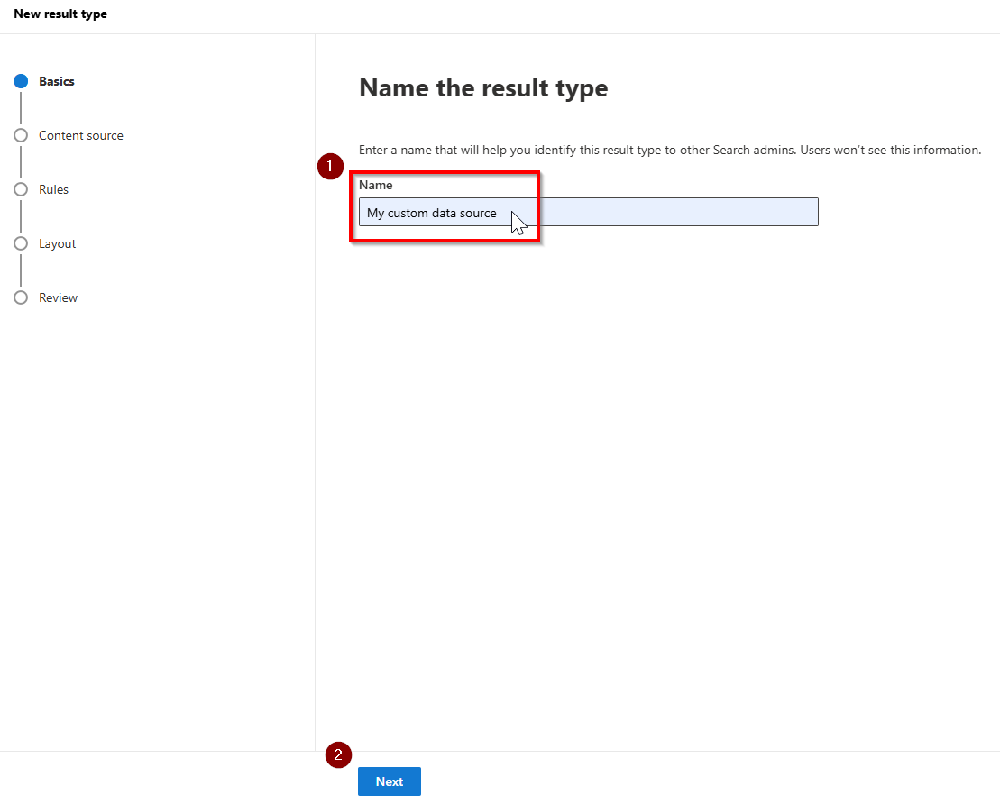
  
4. At the _Select a content source_ step, select the content source you have added in step 1 and click _Next_ at the bottom.

   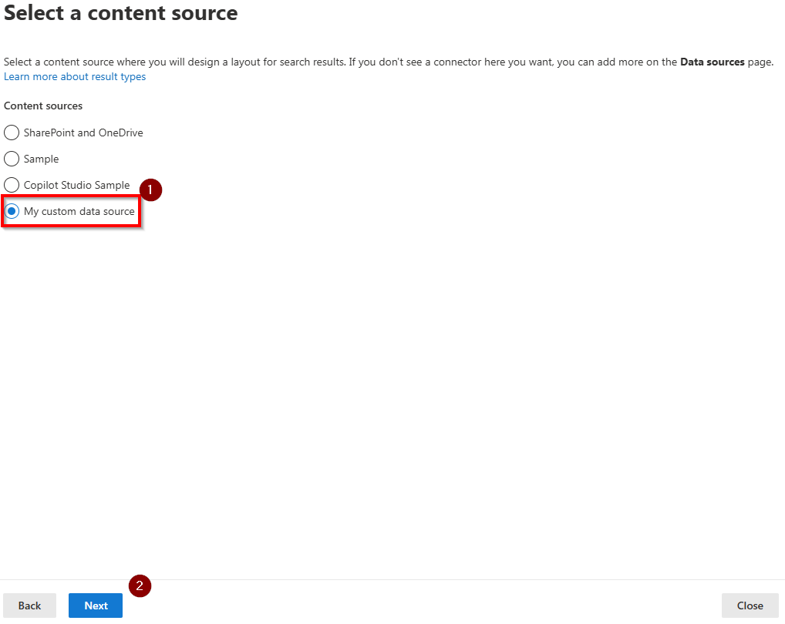
   
6. Skip the _Set rules for the result type_ step by clicking _Next_ at the bottom.

   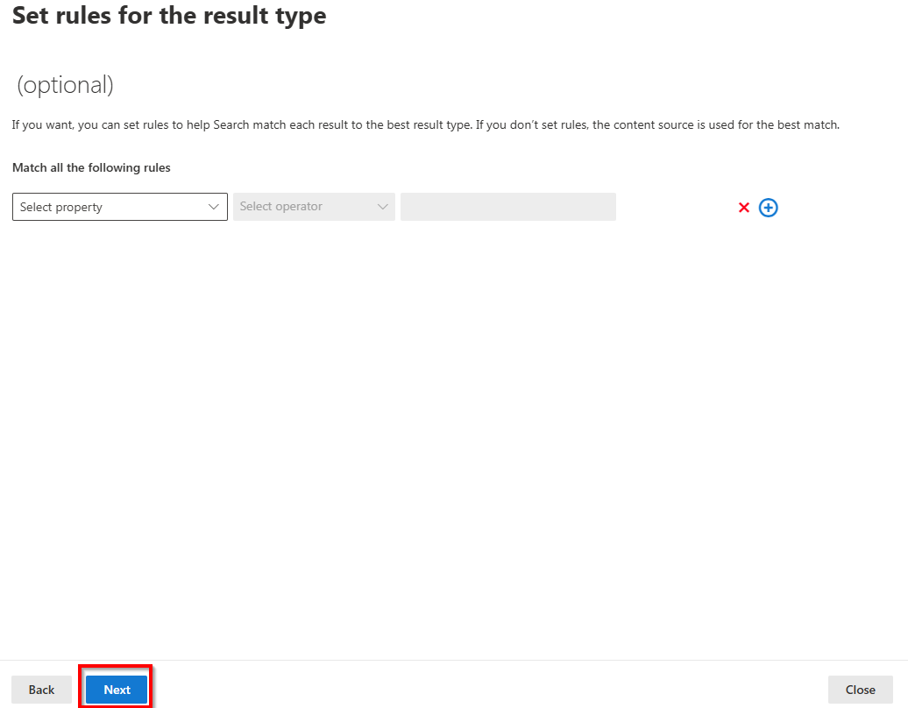
   
8. In the _Design your layout_ step, notice the properties shown at the bottom of this step under _Available properties_ and click on the _Launch Layout Designer_ button.

   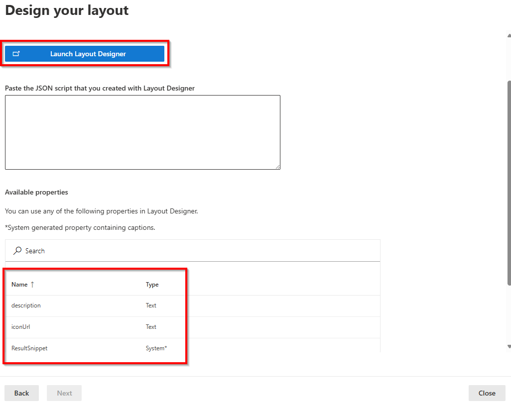
   
10. In the _Search Layout designer_ website that opens, pick a design that you like best for rendering the search results coming from your custom connector, i.e. the first one, and click _Get Started_ at the bottom.

   

11. Click on each element in the visual sample of the search result and ensure that each element gets a property mapping. You can find which ones you can use back in the wizard we just came from, under the _Available properties_ section. Just type over the name of the property you would like to link to each element in the result. If there's an element in the result you don't want to map or use, you must delete it by clicking on the _Edit layout_ button at the top, selecting the element to remove, and clicking on the circle with the X next to it to remove it. Only after you provided a property mapping for each of the elements, the _Create layout_ button at the bottom will become available and you can continue by clicking on that button.

   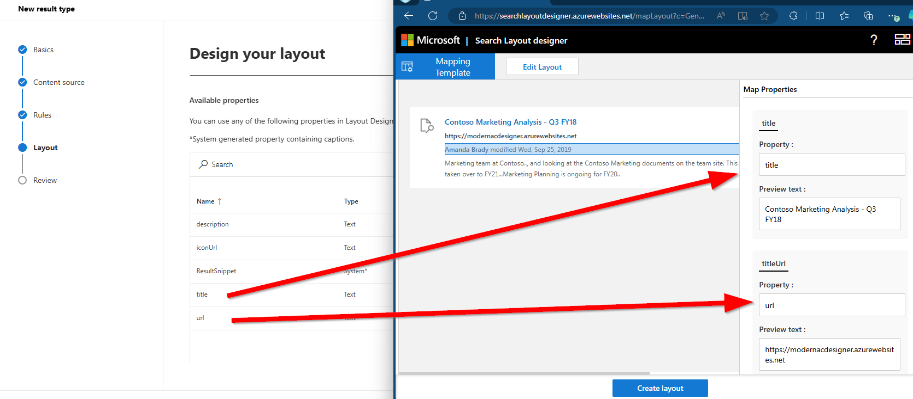

9. Click on _Okay_ in the dialog that will show to confirm. Return back to your browser tab with the _Design your layout_ step in the wizard.

   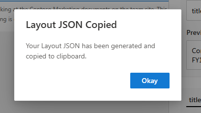

10. Paste the contents of your clipboard (CTRL+V) into the _Paste the JSON script that you created with Layout Designer_ field and click _Next_ at the bottom.

    Alternatively, if you're having problems creating your own design layout, if you stuck with the samples used above, you can use this schema which maps all the fields used in the sample above to the layout:

```JSON
{
    "type": "AdaptiveCard",
    "version": "1.3",
    "body": [
        {
            "type": "ColumnSet",
            "columns": [
                {
                    "type": "Column",
                    "width": "auto",
                    "items": [
                        {
                            "type": "Image",
                            "url": "https://searchuxcdn.blob.core.windows.net/designerapp/images/DefaultMRTIcon.png",
                            "horizontalAlignment": "Center",
                            "size": "Small"
                        }
                    ],
                    "horizontalAlignment": "Center"
                },
                {
                    "type": "Column",
                    "width": "stretch",
                    "items": [
                        {
                            "type": "ColumnSet",
                            "columns": [
                                {
                                    "type": "Column",
                                    "width": "auto",
                                    "items": [
                                        {
                                            "type": "TextBlock",
                                            "text": "[${title}](${url})",
                                            "weight": "Bolder",
                                            "size": "Medium",
                                            "maxLines": 3,
                                            "color": "Accent"
                                        }
                                    ],
                                    "spacing": "None"
                                }
                            ],
                            "spacing": "Small"
                        },
                        {
                            "type": "TextBlock",
                            "text": "[${url}](${url})",
                            "spacing": "Small",
                            "weight": "Bolder",
                            "color": "Dark"
                        },
                        {
                            "type": "TextBlock",
                            "text": "${description}",
                            "maxLines": 2,
                            "wrap": true,
                            "spacing": "Small"
                        }
                    ],
                    "spacing": "Medium"
                }
            ]
        }
    ],
    "$schema": "http://adaptivecards.io/schemas/adaptive-card.json",
    "$data": {}
}
```

11. Click on _Add result type_ at the bottom

    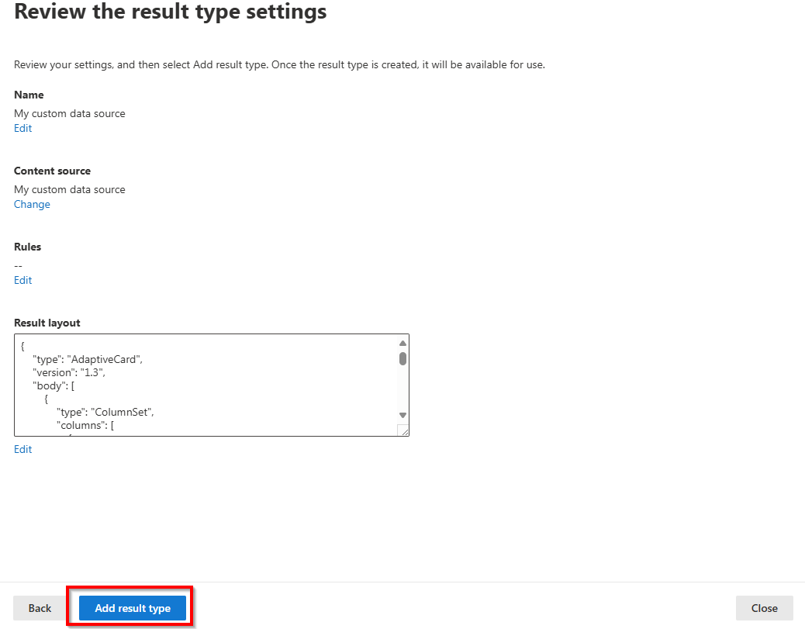

12. Click on _Done_ on the _Your result type is added_ page to complete this step.

    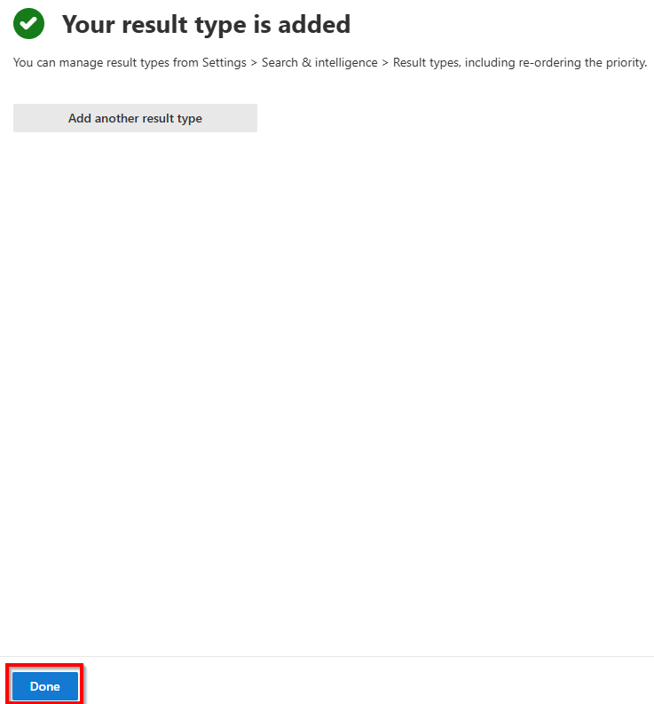
    
### Step 5: Ingesting content into Microsoft 365 Search

Now we're finally ready to start ingesting our content into the Microsoft 365 Search index. How or where you get the actual content from varies largely on the system you wish to pull the data from and is therefore out of scope of this article. Once you have the content, you can create new items into the Microsoft 365 Search Index by executing the cmdlet [Set-PnPSearchExternalItem](../cmdlets/Set-PnPSearchExternalItem.md):

```powershell
Set-PnPSearchExternalItem -ConnectionId "mycustomdatasource" -ItemId "1" -Properties @{ "title"="Test of this PnP PowerShell Connector"; "description"="This is a sample item"; "url"="https://microsoft.com/articlexyz"; "iconUrl"="https://raw.githubusercontent.com/pnp/media/40e7cd8952a9347ea44e5572bb0e49622a102a12/parker/ms/300w/parker-ms-300.png" } -ContentValue "This is sample content that will be indexed. By searching for something that appears in this content, it should be returned by Microsoft 365 Search." -ContentType Text -GrantEveryone
```


Few things to notice with this cmdlet:

- Ensure the `-ConnectionId` matches the `-Identity` name you have used for your custom connector in step 1.
- The `-ItemId` is unique for this result. You can pick whatever you wish, but you need this exact same Id again to update or remove this result. At present, there is no cmdlet or API to retrieve all Ids of all items that are in the Microsoft 365 Search index already, so you may even want to keep a record of this somewhere yourself.
- The Properties match with the property names you have used in the schema in step 2. These values are mapped to the elemets you defined in step 4.
- The ContentValue is the content of the item you are indexing. Microsoft Search uses this content to try to match this as a result when searching for something.
- It will take up to an hour before ingested items will start to appear in search or Copilot results. Be patient.
- You can restrict who can see the result with the grant options. Check the [documentation of the cmdlet](../cmdlets/Set-PnPSearchExternalItem.md) for all possibilities. This sample sets it so that any user in the tenant can see the result.
