# Register an Entra ID Application to use with PnP PowerShell

It has always been a recommended practise to register your own Entra ID Application to use with PnP PowerShell. As of September 9<sup>th</sup>, 2024, [this has become mandatory step](https://pnp.github.io/blog/post/changes-pnp-management-shell-registration/). This article will guide you through how to do so.

The first decission you will have to make is whether you are going to interactively log on through Pnp PowerShell to your tenant by providing your credentials, [Interactive Login](#setting-up-access-to-your-own-entra-id-app-for-interactive-login), or if you are aiming to write a script that will log on without requiring any user intervention, [App Only Access](#setting-up-access-to-your-own-entra-id-app-for-app-only-access). Depending on your scenario, continue reading in the appropriate section below.

## Setting up access to your own Entra ID App for Interactive Login

In this scenario, you will be creating an application registration in Entra ID which will allow you to interactively log on to your tenant using PnP PowerShell. This means that each time you use PnP PowerShell, you will need to enter your credentials and comply with any multi factor authentication and conditional access policies that may have been set up on your tenant.

There are two methods to create your application registration for this scenario: creating it [automatically](#automatically-create-an-app-registration-for-interactive-login) (easiest) or creating it [manually](#manually-create-an-app-registration-for-interactive-login). Both will require you to have at least the [Application Developer permission role](https://learn.microsoft.com/entra/identity/role-based-access-control/permissions-reference#application-developer) or the [Global Administrator permission role](https://learn.microsoft.com/en-us/entra/identity/role-based-access-control/permissions-reference#global-administrator). The first should be enough to create the application registration in Entra ID, whenever this has been disabled for normal users, but Global Administrator permissions might be needed after this to set the desired permissions on the application registration. See [determining which permissions you need](determinepermissions.md) for more information.

Proceed in the section below which matches with your desired option for creating the application registration, [automatically](#automatically-create-an-app-registration-for-interactive-login) or [manually](#manually-create-an-app-registration-for-interactive-login).

### Automatically create an app registration for interactive login

PnP PowerShell has a cmdlet that allows you to register a new Entra ID Application specifically for interactive login. Notice that you need to be able to create App registrations in your Entra ID.

```PowerShell
Register-PnPEntraIDAppForInteractiveLogin -ApplicationName "PnP Rocks" -Tenant [yourtenant].onmicrosoft.com -Interactive
```

When you run the cmdlet above you will be asked to authenticate with your username, password and an optional second factor. After that a new app will be registered in the Entra ID (make sure you have the rights to do this). By default a limited set of permissions scopes is added, but you can provide the one of the permission parameters (`GraphApplicationPermissions`, `GraphDelegatePermissions`, `SharePointApplicationPermissions`, `SharePointDelegatePermissions`) to provide your own permission scopes. 

After the app has been registered you will be asked to provide consent for the application. Alternatively you can ask someone with the appropriate access rights to navigate to the app registration in the Entra ID portal to add them for you. See [determining which permissions you need](determinepermissions.md) for more information.

### Manually create an app registration for interactive login

Another option is to manually create the application registration in Entra ID. While the automatic method above is by far the easiest and quickest, for those that like to fully understand each step of the process, can follow this steps in this paragraph in order to create it manually. 

1. [Navigate to the Entra ID portal](https://entra.microsoft.com) and authenticate with an account that has permissions to create application registrations

1. Using the menu on the left, go to _Identity_ > _Applications_ > _App registrations)
   
   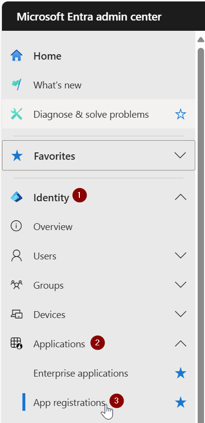

1. At the top, click on _New registration_
   
   

1. In the _Name_ field, enter any name you would like which indicates to you what the purpose of this script is. Leave the rest of the fields as they are and click on _Register_ at the bottom of the page.
   
   

1. Take note of the _Application (client) ID_ value, as you will use this to connect to PnP PowerShell using the application registration you have just created
   
   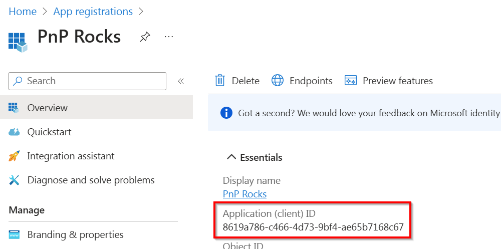

1. In the menu, look for _Manage_ and click on _Authentication_
   
   

1. Under _Platform configurations_ on the page, click on _Add a platform_
   
   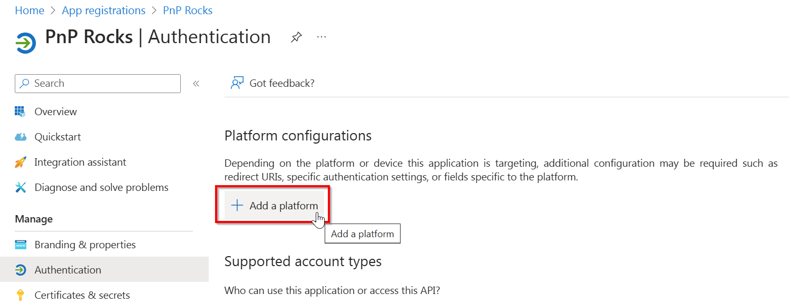

1. In the panel that shows up on the right, click on _Mobile and desktop applications_
   
   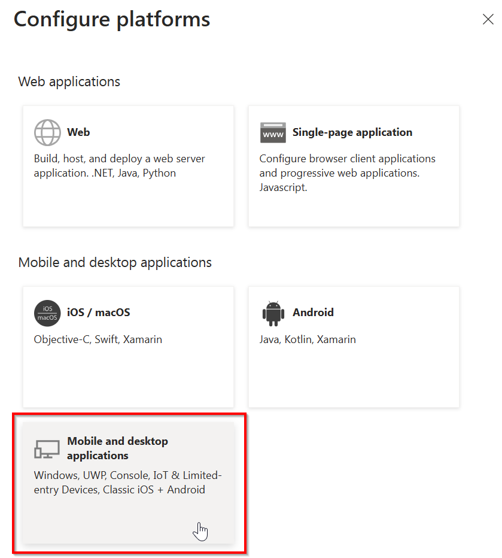

1. Leave the three boxes shown in the panel on the right unchecked and in the _Custom redirect URIs_ field, enter:

   http://localhost

   Note that this should really be http and not https

   Click on _Configure_ at the bottom

   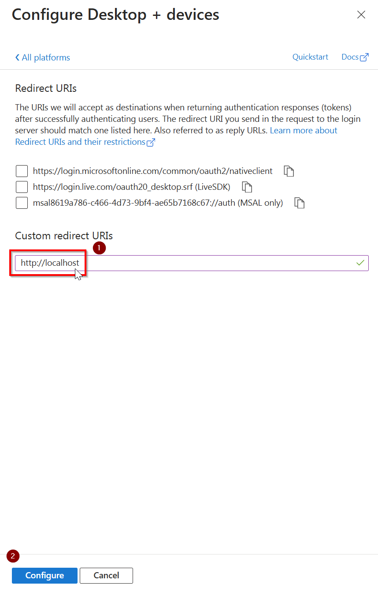

1. Under _Manage_ go to _API permissions_
   
   

1. In the _Configured permissions_ section, click on the three dots in the line that reads _Microsoft Graph (1)_ and click on _Remove all permissions_ and click on _Yes, remove_ in the confirmation dialog that will show up.
   
   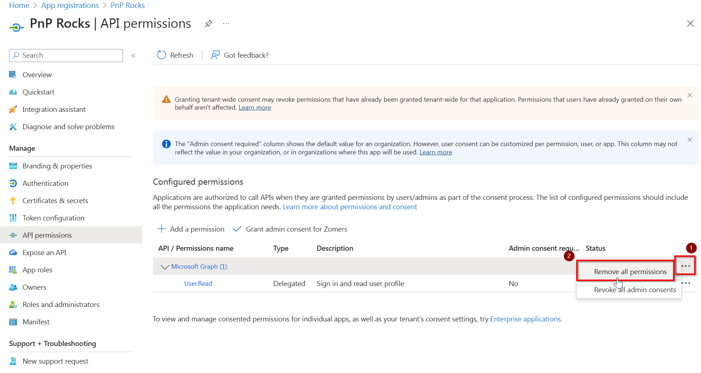

1. In the _Configured permissions_ section, click on _Add a permission_
   
   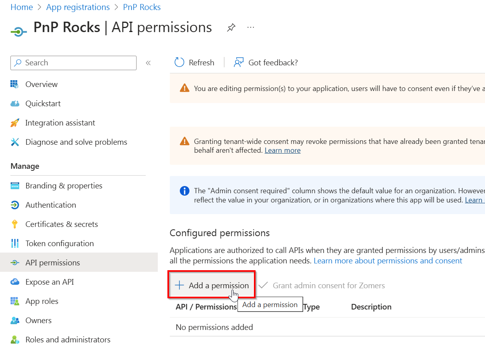

1. In the panel on the right, stay in the _Microsoft APIs_ category and scroll down to _SharePoint_ and click on it
   
   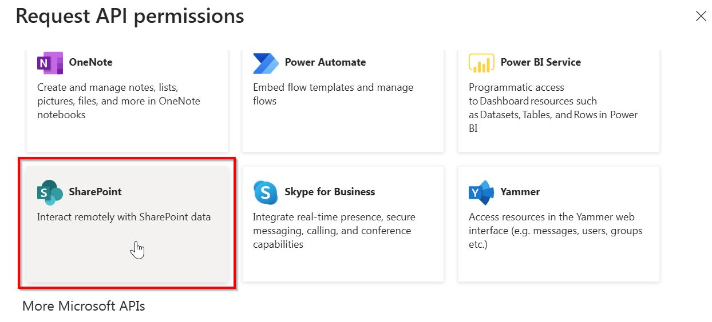

1. Click on _Delegated permissions_
   
   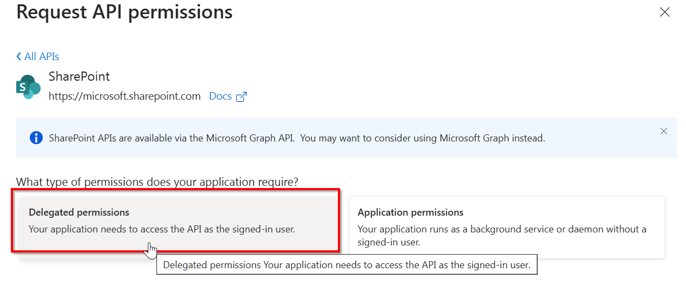

1. Expand _AllSites_ and check the box for _AllSites.Read_ or any other permission you wish to use with your application registration and click on _Add permissions_ at the bottom
   
   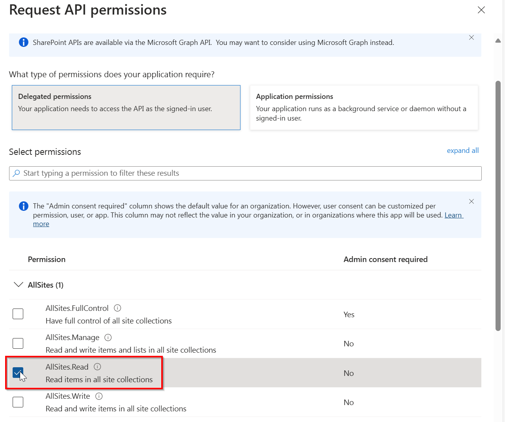

1. Under _Configured permissions_ click on _Grant admin consent for -organization name-_

   If this button is greyed out, it means you do not have the proper permissions to provide the consent. Log in using an account or ask someone having the Global Administrator role to perform this step for you if this is the case.

   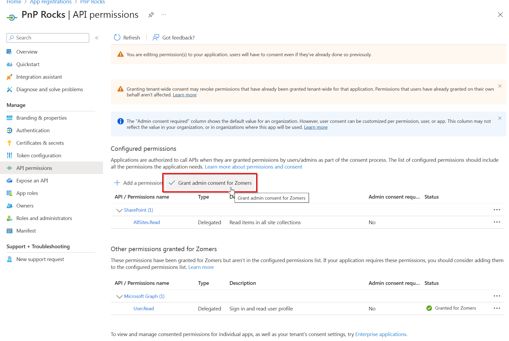

1. In the panel on the right, select _No, remove other granted permissions_ and click on _Grant admin consent_ at the bottom. In the confirmation dialog that appears, click _Yes_.
   
   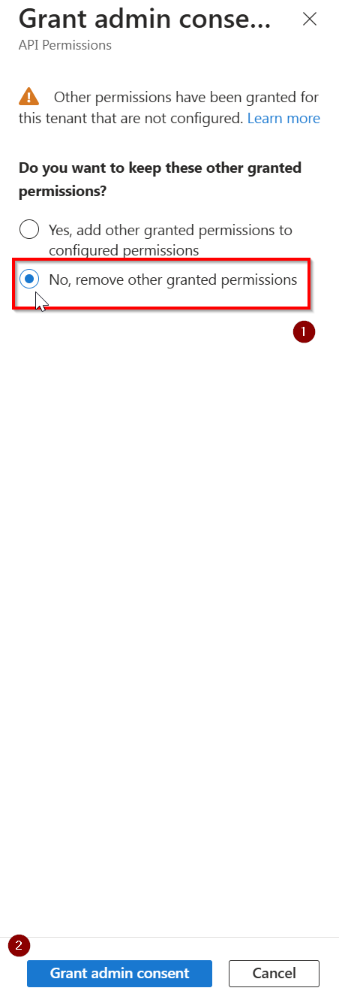

1. The _Configured permissions_ section should now look similar to the screenshot below. You can now use this application to [connect to PnP PowerShell](connecting.md) or [add additional permissions](determinepermissions.md) to this application registration as necessary.
   
   
                                                    
## Setting up access to your own Entra ID App for App Only Access

If you're looking to register an application in Entra ID to use PnP PowerShell with a script that will run without requiring user interaction, App Only described in this section is what you want to go with.

PnP PowerShell has a cmdlet that allows you to register a new Entra ID App, and optionally generate the certificates for you to use to login with that app. 

```PowerShell
$result = Register-PnPEntraIDApp -ApplicationName "PnP Rocks" -Tenant [yourtenant].onmicrosoft.com -OutPath c:\mycertificates -DeviceLogin
$result
```

When you run the cmdlet above you will be asked to navigate to the shown url and enter the code shown. After that a new app will be registered in the Entra ID (make sure you have the rights to do this), and a certificate will be generated and uploaded to that app. After this a URL will be shown which you have to navigate to to provide consent for this application. By default a limited set of permissions scopes is added, but you can provide the one of the permission parameters (`GraphApplicationPermissions`, `GraphDelegatePermissions`, `SharePointApplicationPermissions`, `SharePointDelegatePermissions`) to provide your own permission scopes.

It also returns the private key certificate encoded in base64 encoding. As it spans multiple lines, it is recommended to assign the outcome of `Register-PnPAzureAdApp` to a variable so you have access to this value more easily. The Base64 encoded private key certificate can be used in your Connect-PnPOnline voiding the need to have access to the physical file:

```PowerShell
Connect-PnPOnline [yourtenant].sharepoint.com -ClientId [clientid] -Tenant [yourtenant].onmicrosoft.com -CertificateBase64Encoded [pfx base64 encoded]
```

The cmdlet will also save both the CER and PFX files to the location specified with the -Outpath parameter. The names of the files will be matching the -ApplicationName parameter, e.g. in the example above the files will be called `PnP Rocks.cer` and `PnP Rocks.pfx`. The output of the cmdlet will show the clientid. After all is set up and consent has been provided you can login using:

```PowerShell
Connect-PnPOnline [yourtenant].sharepoint.com -ClientId [clientid] -Tenant [yourtenant].onmicrosoft.com -CertificatePath [certificate.pfx]
```
